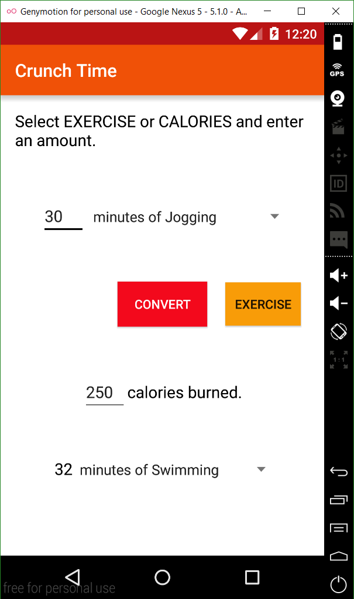

# PROG 01: Crunch Time

Crunch Time is an app that allows users to select an exercise, enter the amount they did, and then convert the amount into the number of calories they burned as well as the equivalent amount of another exercise. Alternatively, users can enter the amount of calories they wish to burn and find out how much of a selected exercise they must do to burn that amount.

## Authors

Nathaniel Low ([low.nathaniel@berkeley.edu](mailto:low.nathaniel@berkeley.edu))

## Demo Video

See [Crunch Time] (http://youtu.be/Cvral3XKF44?hd=1)

## Screenshots

## Acknowledgments

* App programmed using Android Studio
* Video recorded using Screencast-O-Matic
* Special thanks to Jack Thakar (@jathak) for tips on Android programming
